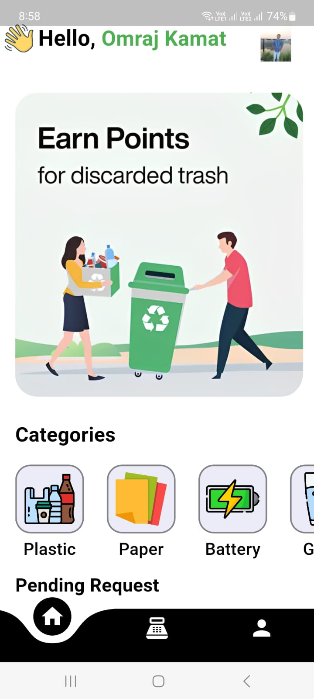
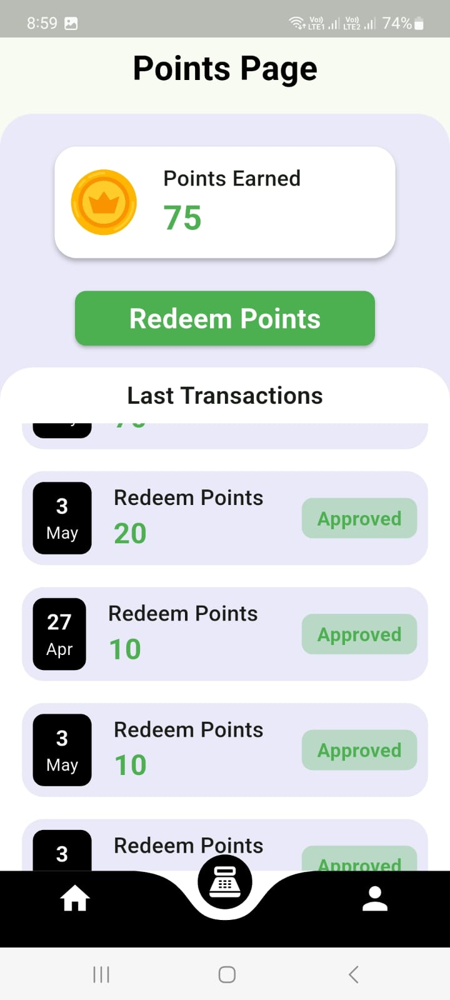
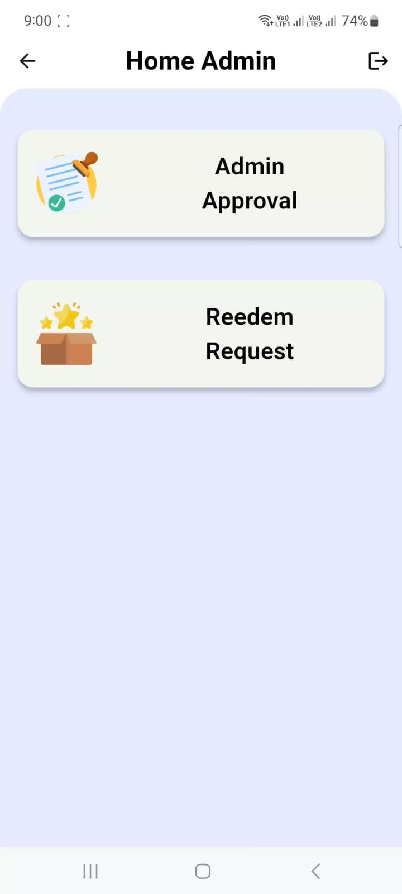

# ♻️ Recycle App - Flutter and Firebase

## 🌟 Overview
The **Recycle App** is a mobile application built using **Flutter** and **Dart**, integrated with **Firebase** and **Firestore**. The app provides a platform where users can recycle items and earn points, which can be redeemed for money via **UPI**. The app includes both a **User** and **Admin panel** with **Google authentication**, **request approvals**, and a **points system**.

## 📸 Screenshots

<p align="center">
  
  
  
</p>

<p align="center">
  <span style="display:inline-block; width:200px; text-align:center;"></span>
  <span style="display:inline-block; width:200px; text-align:center;"></span>
  <span style="display:inline-block; width:200px; text-align:center;"></span>
</p>


## 🚀 Features
### **User Panel:**
- 🔑 Sign in using **Google authentication**.
- 📚 Browse categories of recyclable items.
- ➕ Submit requests to recycle items.
- 💰 Track points earned from approved recycle requests.
- 🏦 Redeem points for money via **UPI**.
- 👤 User profile page to manage logout and account deletion.

### **Admin Panel:**
- 🔒 Admin login with credentials.
- ✅ Review and approve user requests for recycling.
- 💵 Manage users' redeem point requests and transfer money to UPI accounts.

## 💻 Technologies Used
- **Frontend:** Flutter, Dart
- **Backend:** Firebase, Firestore
- **Authentication:** Google Sign-In
- **Database:** Firestore (for storing user data, requests, and points)

## 🛠️ Setup Instructions

### 🔧 Prerequisites
- **Flutter SDK** installed.
- **Firebase account** and Firebase project setup.
- Android or iOS device or emulator for testing.

### 🚀 Getting Started

1. **Clone the repository:**

   ```bash
   git clone <repository_url>
   ```

2. **Install dependencies:**

   Navigate to the project directory and run:

   ```bash
   flutter pub get
   ```

3. **Set up Firebase:**

   - Go to the Firebase console: [Firebase Console](https://console.firebase.google.com)
   - Create a new project or use an existing one.
   - Set up **Firebase Authentication** (Google Sign-In) and **Firestore**.
   - Add Firebase configuration files (`google-services.json` for Android or `GoogleService-Info.plist` for iOS) to your project.

4. **Configure Firebase for your app:**

   - In the Firebase console, enable **Google authentication** and set up Firestore to store user data, requests, and points.
   - Update your `firebase_options.dart` file with your Firebase project settings.

5. **Run the app:**

   - For Android:

     ```bash
     flutter run
     ```

   - For iOS:

     ```bash
     flutter run
     ```

## 📝 Usage
### **User Flow:**
1. 🔑 Sign in via **Google Auth**.
2. 🛍️ Browse and select categories for recycling items.
3. ➕ Submit requests and track points on the **Points** page.
4. 💵 Redeem points by entering **UPI** details and submitting a redeem request.

### **Admin Flow:**
1. 🔐 Admin logs in with credentials.
2. ✅ Review and approve recycling requests from users.
3. 💰 Review and process point redemption requests from users.

## 🤝 Contributing
Feel free to fork this project, submit issues, and create pull requests for any enhancements or bug fixes. Contributions are welcome!

## 🙏 Acknowledgments
- **Flutter** for the mobile framework.
- **Firebase** for backend services.
- **Google** for authentication support.
